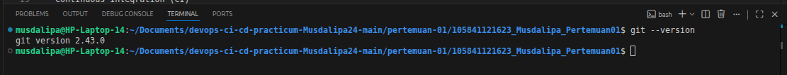
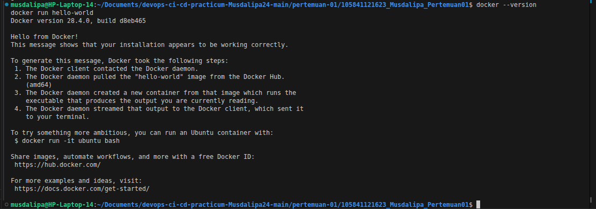
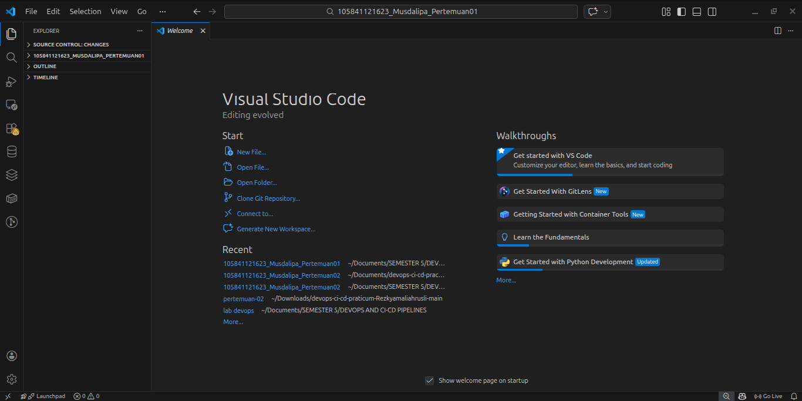

# Laporan Praktikum DevOps - Pertemuan 01

Nama  : Musdalipa  
NIM   : 105841121623
Kelas : 5 RPL B

---

## 1. Pengertian DevOps

DevOps adalah pendekatan dalam pengembangan perangkat lunak yang mengintegrasikan tim Development (Dev) dan Operations (Ops) untuk meningkatkan kolaborasi, otomatisasi, dan kecepatan dalam proses delivery aplikasi.

DevOps menekankan pada:
- Automation
- Continuous Integration (CI)
- Continuous Delivery (CD)
- Monitoring
- Containerization
- Version Control

---

## 2. Mengapa DevOps Penting?

DevOps penting karena:

1. Mempercepat proses pengembangan dan deployment aplikasi
2. Mengurangi human error melalui otomatisasi
3. Meningkatkan kolaborasi antar tim
4. Mempermudah scaling aplikasi
5. Meningkatkan stabilitas sistem

Banyak perusahaan teknologi besar seperti Google, Amazon, dan Netflix menerapkan DevOps untuk memastikan layanan mereka berjalan cepat, stabil, dan efisien.

---

## 3. Setup Development Environment

Pada praktikum ini telah dilakukan setup environment sebagai berikut:

### Git
- Instalasi Git pada Ubuntu
- Konfigurasi user.name dan user.email
- Verifikasi menggunakan perintah:
- git --version
Screenshot:

---

### Docker
- Instalasi Docker Engine
- Konfigurasi agar dapat dijalankan tanpa sudo
- Verifikasi menggunakan:
- docker --version
- docker run hello-world
Screenshot:

---

### Visual Studio Code
- Instalasi VS Code
- Instalasi Extensions:
- Docker
- GitLens
- YAML
Screenshot:
